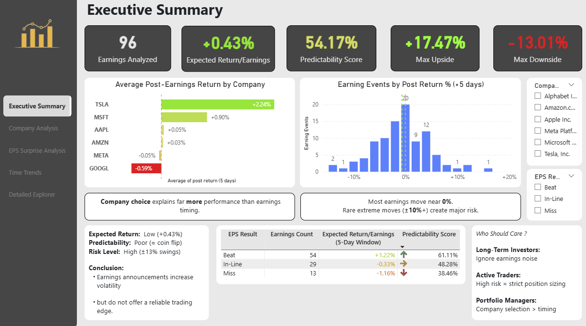
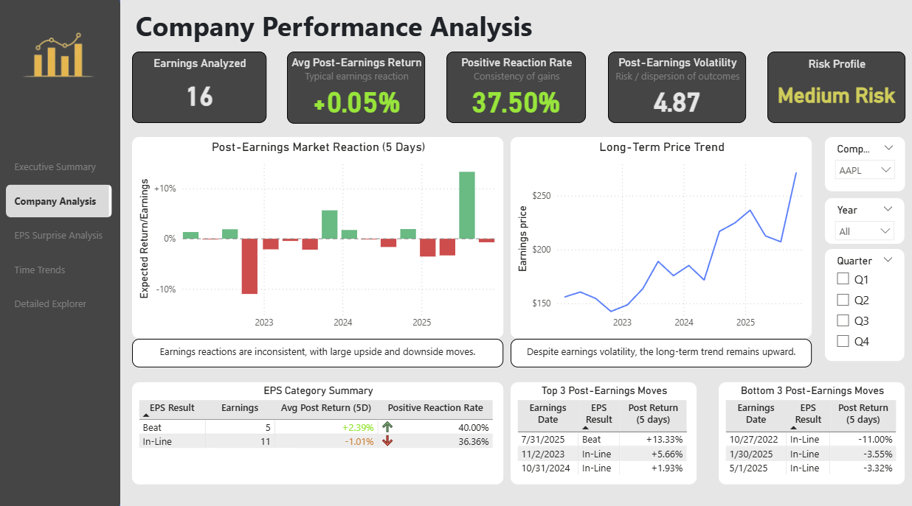
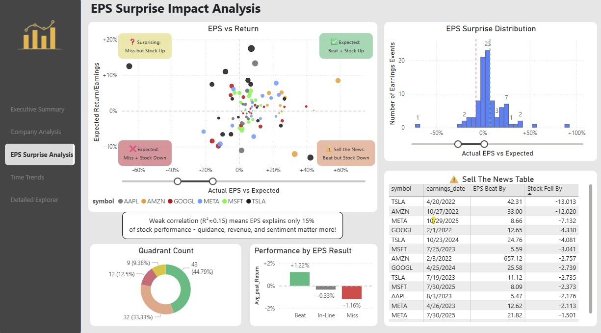
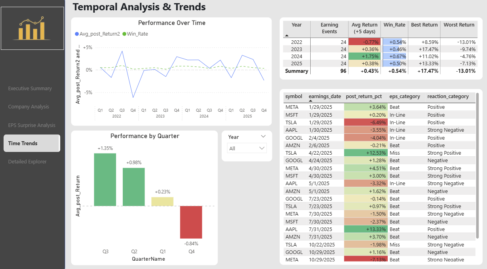
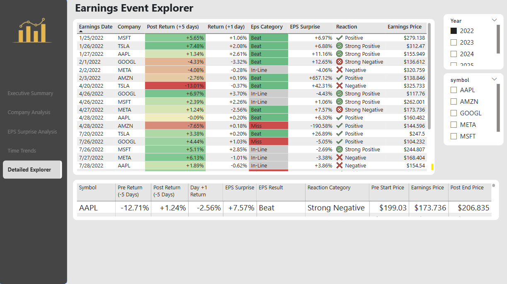

# Earnings Reaction Analysis (API → SQL → Power BI)

Measure how stock prices react to quarterly earnings announcements using an end-to-end analytics pipeline: data ingestion (Yahoo Finance) → cleaning/feature engineering (Python) → storage/querying (SQLite) → interactive reporting (Power BI).

**Scope:** 6 Big Tech companies (AAPL, MSFT, GOOGL, AMZN, META, TSLA), 2022–2026, ±5 trading days around each earnings date  
**Deliverables:** SQLite database + reproducible scripts + Power BI dashboard (screenshots below)  
**Disclaimer:** Educational project only — not financial advice.

---

## Business questions answered

1. **Do stocks tend to rise after “beats” vs “misses”?** (beat / in-line / miss impact on post-earnings returns)  
2. **Which companies show the most consistent post-earnings behavior?** (win rate + dispersion by company)  
3. **How often does “sell the news” occur?** (beats that still lead to negative returns)  
4. **How strong is the relationship between EPS surprise and price reaction?** (correlation + outliers/limits)  
5. **Are there time patterns (year/quarter) in post-earnings reactions?**

---

## Dashboard preview (Power BI)


  
  
  
  


---

## Key results (high level)

- **Beating earnings helps** - but only gives +1.22% average return (vs -1.16% for misses).  
- **Company differences:** reactions vary meaningfully by company (some more volatile, some more stable).
-   **Tesla outperforms:** +2.24% average return per earnings, 56.25% win rate.
-   **Google disappoints:** -0.59% average return despite often beating estimates.
- **“Sell the news” exists:** a non-trivial share of beats still lead to negative returns.  
- **Predictability is limited:** outcomes remain noisy; this is better for *directional insight* than “prediction.” 54.17% win rate (barely better than coin flip)


---

## What this project demonstrates (skills)

- **Data acquisition:** API ingestion (yfinance) + handling missing/uneven fields  
- **Data engineering:** cleaning, type enforcement, timezone normalization, validations  
- **Analytics:** metric design (pre/post windows), categorization, outlier handling  
- **SQL:** schema design, constraints, indexes, analytical queries  
- **BI:** star-schema modeling, DAX measures, dashboard UX and interactivity  
- **Communication:** documented methodology, assumptions, and limitations

---

## Data sources

- **Prices & earnings:** Yahoo Finance via `yfinance`  4,500+ daily prices
- **Period:** 2022-01-01 → 2026-01-16  
- **Window:** 5 trading days before + 5 trading days after earnings

---

## Repository structure

```
├── scripts/              # data collection, metric calculation, exports
├── sql/                  # database schema & queries
├── data/sample/          # small sample datasets 
├── notebooks/            # optional exploration notebooks
├── visualizations/       # charts & dashboard screenshots
└── docs/                 # methodology, insights, technical notes
```

---

## Methodology (summary)

For each earnings event:
- Collect daily prices around the event date  
- Compute:
  - **Pre-earnings return** (5 days before)
  - **Post-earnings return** (5 days after)
  - **Immediate reaction** (next trading day)
  - **EPS surprise %** = (Actual − Estimate) / |Estimate| × 100  
- Categorize:
  - EPS: **Beat / In-line / Miss**
  - Reaction: **Strong positive / positive / negative / strong negative**

Full details: [`docs/METHODOLOGY.md`](docs/METHODOLOGY.md)

---

## Quickstart (reproducible)

### 1) Install
```bash
python -m venv .venv
# Windows: .venv\Scripts\activate
# macOS/Linux: source .venv/bin/activate

pip install -r requirements.txt
```

### 2) Run pipeline
```bash
# Collect raw data (Yahoo Finance)
python scripts/collect_data.py

# Calculate metrics + write to SQLite + export CSV for Power BI
python scripts/calculate_metrics.py
```

### 3) Open dashboard
- Open `dashboards/Earnings_Analysis_Dashboard.pbix` in Power BI Desktop  
- Refresh if needed, or load from exported CSVs (see `docs/SETUP.md`)

Full setup guide: [`docs/SETUP.md`](docs/SETUP.md)

---

## Sample SQL query

```sql
-- Which companies have the best post-earnings track record?
SELECT 
  symbol,
  COUNT(*) AS earnings_count,
  ROUND(AVG(post_return_pct), 2) AS avg_return,
  ROUND(
    SUM(CASE WHEN post_return_pct > 0 THEN 1 ELSE 0 END) * 100.0 / COUNT(*),
    1
  ) AS win_rate
FROM earnings_analysis
GROUP BY symbol
ORDER BY avg_return DESC;
```

More queries: [`sql/queries.sql`](sql/queries.sql)

---

## Limitations 

- **Small sample size per company** (quarterly earnings events are limited).  
- **Confounding factors:** macro news, guidance, sentiment, and other events can dominate post-earnings moves.  
- **Data gaps:** EPS estimate/actual fields may be missing for some periods.  
- **Not predictive:** results are descriptive and directional; not a trading system.

---

## Next steps

- Expand to more companies and sectors  
- Build machine learning prediction model  
- Create real-time dashboard with automated data refresh  
- Analyze longer time period

---

## Contact

**Youssef Ben Abdallah**  
Email: youssef.bena.it@gmail.com  
LinkedIn: https://www.linkedin.com/in/youssefbena/  
GitHub: https://github.com/Youssef-bena  

---

## License

MIT — see [`LICENSE`](LICENSE).
